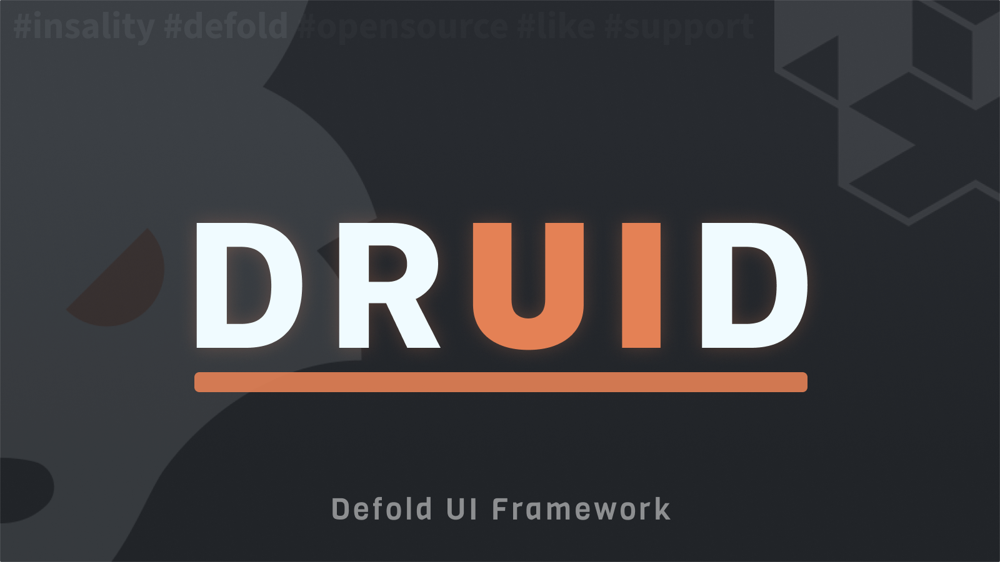
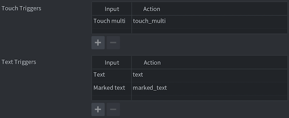

[](https://insality.github.io/druid/)

[](https://github.com/sponsors/insality) [](https://ko-fi.com/insality) [](https://www.buymeacoffee.com/insality)

[](https://github.com/Insality/druid/releases)
[](https://github.com/Insality/druid/actions)
[](https://codecov.io/gh/Insality/druid)

**Druid** - powerful Defold component UI library. Use basic and extended **Druid** components or make your own game-specific components to make amazing GUI in your games.


## Setup

### Dependency

You can use the **Druid** extension in your own project by adding this project as a [Defold library dependency](https://www.defold.com/manuals/libraries/). Open your game.project file and in the dependencies field under project add:

> [https://github.com/Insality/druid/archive/master.zip](https://github.com/Insality/druid/archive/master.zip)

Or point to the ZIP file of a [specific release](https://github.com/Insality/druid/releases).

### Input bindings

**Druid** requires the following input bindings:

- Mouse trigger - `Button 1` -> `touch` _For basic input components_
- Mouse trigger - `Wheel up` -> `mouse_wheel_up` _For scroll component_
- Mouse trigger - `Wheel down` -> `mouse_wheel_down` _For scroll component_
- Key trigger - `Backspace` -> `key_backspace`  _For back_handler component, input component_
- Key trigger - `Back` -> `key_back`  _For back_handler component, Android back button, input component_
- Key trigger - `Enter` -> `key_enter` _For input component, optional_
- Key trigger - `Esc` -> `key_esc` _For input component, optional_
- Touch triggers - `Touch multi` -> `touch_multi` _For scroll component_





### Change key bindings [optional]
If you have to use your own key bindings (and key name), you can change it in your *game.project* file.

Here is current default values for key bindings:
```
[druid]
input_text = text
input_touch = touch
input_marked_text = marked_text
input_key_esc = key_esc
input_key_back = key_back
input_key_enter = key_enter
input_key_backspace = key_backspace
input_multitouch = touch_multi
input_scroll_up = mouse_wheel_up
input_scroll_down = mouse_wheel_down
```


### Input capturing [optional]

By default, **Druid** will auto-capture input focus, if any input component will be created. So you don't need to call `msg.post(".", "acquire_input_focus")`

If you don't need this behaviour, you can disable it by setting `druid.no_auto_input` field in _game.project_:
```
[druid]
no_auto_input = 1
```


### Template name check [optional]

By default, **Druid** will auto check the parent component template name to build the full template name for component.

If for some reason you want to pass the full template name by yourself, you can disable it by setting `druid.no_auto_template` field in _game.project_:

```
[druid]
no_auto_template = 1
```


### Stencil check [optional]

When creating input components inside stencil nodes, **Druid** automatically setup `component:set_click_zone()` on _late_init_ component step to restrict input clicks outside this stencil zone.
To disable this feature add next field in your _game.project_ file
```
[druid]
no_stencil_check = 1
```


### Code [optional]

Adjust **Druid** settings, if needed:
```lua
local druid = require("druid.druid")

-- Used for button component and custom components
-- Callback should play sound by name
druid.set_sound_function(callback)

-- Used for lang_text component
-- Callback should return localized string by locale id
druid.set_text_function(callback)

-- Used for change default druid style
druid.set_default_style(your_style)

-- Call this function on language changing in the game,
-- to retranslate all lang_text components:
druid.on_language_change()

-- Call this function inside window.set_listener
-- to catch game focus lost/gained callbacks:
druid.on_window_callback(event)
```


## Components

Here is full **Druid** components list:

| Name | Description | API page | Example Link | Is Basic component[^1] | Preview |
|------|-------------|----------|------------|-------------|---------|
| **[Button](docs_md/01-components.md#button)** | Basic input component. Handles all types of interactions: click, long click, hold click, double click, etc | [Button API](https://insality.github.io/druid/modules/Button.html) | [Button Example](https://insality.github.io/druid/druid/?example=general_buttons) | ✅ |  |
| **[Text](docs_md/01-components.md#text)** | Wrap on GUI text node, handle different text size adjusting, providing additional text API | [Text API](https://insality.github.io/druid/modules/Text.html) | [Text Example](https://insality.github.io/druid/druid/?example=texts_general) | ✅ |  |
| **[Scroll](docs_md/01-components.md#scroll)** | Scroll component | [Scroll API](https://insality.github.io/druid/modules/Scroll.html) | [Scroll Example](https://insality.github.io/druid/druid/?example=general_scroll) | ✅ |  |
| **[Blocker](docs_md/01-components.md#blocker)** | Block user input in node zone area | [Blocker API](https://insality.github.io/druid/modules/Blocker.html) | ❌ | ✅ | |
| **[Back Handler](docs_md/01-components.md#back-handler)** | Handle back button (Android back button, backspace key) | [Back Handler API](https://insality.github.io/druid/modules/BackHandler.html) | ❌ | ✅ | |
| **[Static Grid](docs_md/01-components.md#static-grid)** | Component to manage node positions with equal sizes | [Static Grid API](https://insality.github.io/druid/modules/StaticGrid.html) | [Static Gid Example](https://insality.github.io/druid/druid/?example=general_grid) | ✅ |  |
| **[Hover](docs_md/01-components.md#hover)** | Handle hover node state on node | [Hover API](https://insality.github.io/druid/modules/Hover.html) | ❌ | ✅ |  |
| **[Swipe](docs_md/01-components.md#swipe)** | Handle swipe gestures on node | [Swipe API](https://insality.github.io/druid/modules/Swipe.html) | [Swipe Example](https://insality.github.io/druid/druid/?example=general_swipe) | ✅ |  |
| **[Drag](docs_md/01-components.md#drag)** | Handle drag input on node | [Drag API](https://insality.github.io/druid/modules/Drag.html) | [Drag Example](https://insality.github.io/druid/druid/?example=general_drag) | ✅ |  |
| **[Checkbox](docs_md/01-components.md#checkbox)** | Checkbox component | [Checkbox API](https://insality.github.io/druid/modules/Checkbox.html) | [Checkbox Example](https://insality.github.io/druid/druid/?example=general_checkboxes) | ❌ |  |
| **[Checkbox group](docs_md/01-components.md#checkbox-group)** | Several checkboxes in one group | [Checkbox group API](https://insality.github.io/druid/modules/CheckboxGroup.html) | [Checkbox group Example](https://insality.github.io/druid/druid/?example=general_checkboxes) | ❌ |  |
| **[Radio group](docs_md/01-components.md#radio-group)** | Several checkboxes in one group with a single choice | [Radio group API](https://insality.github.io/druid/modules/RadioGroup.html) | [Radio Group Example](https://insality.github.io/druid/druid/?example=general_checkboxes) | ❌ |  |
| **[Dynamic Grid](docs_md/01-components.md#dynamic-grid)** | Component to manage node positions with different sizes. Only in one row or column | [Dynamic Grid API](https://insality.github.io/druid/modules/DynamicGrid.html) | [Dynamic Grid Example](https://insality.github.io/druid/druid/?example=general_grid) | ❌ |  |
| **[Data List](docs_md/01-components.md#data-list)** | Component to manage data for huge datasets in scroll | [Data List API](https://insality.github.io/druid/modules/DataList.html) | [Data List Example](https://insality.github.io/druid/druid/?example=general_data_list) | ❌ |  |
| **[Input](docs_md/01-components.md#input)** | User text input component | [Input API](https://insality.github.io/druid/modules/Input.html) | [Input Example](https://insality.github.io/druid/druid/?example=general_input) | ❌ |  |
| **[Lang text](docs_md/01-components.md#lang-text)** | Wrap on Text component to handle localization | [Lang Text API](https://insality.github.io/druid/modules/LangText.html) | ❌ | ❌ |  |
| **[Progress](docs_md/01-components.md#progress)** | Progress bar component | [Progress API](https://insality.github.io/druid/modules/Progress.html) | [Progress Example](https://insality.github.io/druid/druid/?example=general_progress_bar) | ❌ |  |
| **[Slider](docs_md/01-components.md#slider)** | Slider component | [Slider API](https://insality.github.io/druid/modules/Slider.html) | [Slider Example](https://insality.github.io/druid/druid/?example=general_sliders) | ❌ |  |
| **[Timer](docs_md/01-components.md#timer)** | Handle timers on GUI text node | [Timer API](https://insality.github.io/druid/modules/Timer.html) | ❌ | ❌ |  |
| **[Hotkey](docs_md/01-components.md#hotkey)** | Handle keyboard hotkeys with key modificators | [Hotkey API](https://insality.github.io/druid/modules/Hotkey.html) | [Hotkey Example](https://insality.github.io/druid/druid/?example=general_hokey) | ❌ |  |
| **[Layout](docs_md/01-components.md#layout)** | Handle node size depends on layout mode and screen aspect ratio | [Layout API](https://insality.github.io/druid/modules/Layout.html) | [Layout Example](https://insality.github.io/druid/druid/?example=general_layout) | ❌ |  |

For a complete overview, see: **_[components.md](docs_md/01-components.md)_**.

[^1]: Non basic components before use should be registered first to be included in build


## Basic usage

To use **Druid**, first you should create a Druid instance to spawn components and add Druids main engine functions: *update*, *final*, *on_message* and *on_input*.

All **Druid** components take node name string as arguments, don't do `gui.get_node()` before.

All **Druid** and component methods are called with `:` like `self.druid:new_button()`.

```lua
local druid = require("druid.druid")

local function button_callback(self)
    print("Button was clicked!")
end

function init(self)
    self.druid = druid.new(self)
    self.druid:new_button("button_node_name", button_callback)
end

function final(self)
    self.druid:final()
end

function on_message(self, message_id, message, sender)
    self.druid:on_message(message_id, message, sender)
end


function on_input(self, action_id, action)
    return self.druid:on_input(action_id, action)
end

```

For all **Druid** instance functions, [see here](https://insality.github.io/druid/modules/druid_instance.html).

## Druid Events

Any **Druid** components as callbacks use [Druid Events](https://insality.github.io/druid/modules/druid_event.html). In component API ([button example](https://insality.github.io/druid/modules/druid.button.html#Events)) pointed list of component events. You can manually subscribe to those events with the following API:

- **event:subscribe**(callback)

- **event:unsubscribe**(callback)

- **event:clear**()

You can subscribe several callbacks to a single event.

## Druid Lifecycle

Here is full Druid lifecycle setup for your ***.gui_script** file:
```lua
local druid = require("druid.druid")

function init(self)
    self.druid = druid.new(self)
end

function final(self)
    self.druid:final()
end

function update(self, dt)
    self.druid:update(dt)
end

function on_input(self, action_id, action)
    return self.druid:on_input(action_id, action)
end

function on_message(self, message_id, message, sender)
    self.druid:on_message(message_id, message, sender)
end
```

- *final* is a **required** function for a correct Druid lifecycle
- *on_input* is used in almost all Druid components
- *update* in used in progress bar, scroll and timer base components
- *on_message* is used for specific Druid events, like language change or layout change

It is recommended to fully integrate all **Druid** lifecycles functions.


## Details

- Druid input goes as stack. Last created button will checked first. So create your GUI from back
- Don't forget about `return` in `on_input`: `return self.druid:on_input()`. It is needed if you have more than 1 acquire inputs (several Druid, other input system, etc)
- By default, Druid will automatically _acquire_input_focus_. So you don't need do it manually. But only if you have components which require _on_input_
- If you want to delete a node which has a Druid component, don't forget to remove it via `druid:remove(component)`

[See full FAQ here](docs_md/FAQ.md)


## Examples

See the [**example folder**](https://github.com/Insality/druid/tree/develop/example) for examples of how to use **Druid**

Try the [**HTML5 version**](https://insality.github.io/druid/druid/) of the **Druid** example app


## Documentation

To better understand **Druid**, read the following documentation:
- [Druid components](docs_md/01-components.md)
- [Create custom components](docs_md/02-creating_custom_components.md)
- [See FAQ article](docs_md/FAQ.md)
- [Druid styles](docs_md/03-styles.md)

You can fund the full **Druid** documentation here:
https://insality.github.io/druid/


## License

- Developed and supported by [Insality](https://github.com/Insality)
- Original idea by [AGulev](https://github.com/AGulev)
- Assets from [Kenney](http://www.kenney.nl/)


## Issues and suggestions

If you have any issues, questions or suggestions please [create an issue](https://github.com/Insality/druid/issues) or contact me: [insality@gmail.com](mailto:insality@gmail.com)


## ❤️ Support project ❤️

Please support me if you like this project! It will help me keep engaged to update **Druid** and make it even better!

[](https://github.com/sponsors/insality) [](https://ko-fi.com/insality) [](https://www.buymeacoffee.com/insality)
